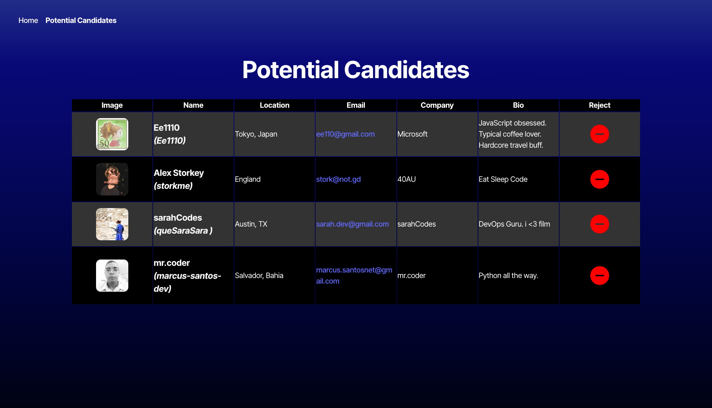

# 🚀 Candidate Search App

A TypeScript React application for employers to search and save potential candidates using the GitHub API. This app allows employers to view GitHub user data, accept or reject candidates, and maintain a list of saved candidates using local storage. Deployed via Render.

## 📸 Screenshots

### Home Page - Candidate View


### Saved Candidates Page


---

## 🧩 Features

- 🔍 Fetches real candidate data from GitHub API.
- ✅ Accept candidates and save them to a potential hire list.
- ❌ Reject candidates without saving.
- 💾 Uses localStorage to persist saved candidates.
- 🌐 Deployed with Render.
- ✅ Built with React and TypeScript for better reliability and maintainability.
- ✨ Bonus: (Optional) Sorting and filtering of candidates.

---

## 📖 User Story

```
AS AN employer  
I WANT a candidate search application  
SO THAT I can hire the best candidates  
```

---

## ✅ Acceptance Criteria

- When the page loads, candidate information (name, username, location, avatar, email, html_url, and company) is shown.
- Clicking the "+" button saves the candidate and moves to the next one.
- Clicking the "-" button skips the candidate.
- When no candidates are left, a "no more candidates" message is displayed.
- On the "Saved Candidates" page, previously accepted candidates are displayed.
- Saved candidates persist after page reloads.
- A message is shown when there are no saved candidates.

---

## 🧪 Technologies Used

- React
- TypeScript
- GitHub REST API
- Vite
- CSS Modules / Tailwind (or whatever your styling choice was)
- LocalStorage
- Render (for deployment)

---

## ⚙️ Getting Started

### 1. Clone the Repository

```bash
git clone https://github.com/jsanc33/personnel-fulfillment.git
cd SPACE-BOATS
```

### 2. Install Dependencies

```bash
npm install
```

### 3. Setup Environment Variables

Create a `.env` file in the `environment` folder based on the provided `.env.EXAMPLE`:

```
VITE_GITHUB_TOKEN=your_personal_access_token_here
```

> 🔐 Get a [GitHub Personal Access Token](https://docs.github.com/en/authentication/keeping-your-account-and-data-secure/managing-your-personal-access-tokens#creating-a-fine-grained-personal-access-token)  
> Make sure it has access to read public data.

### 4. Run the App

```bash
npm run dev
```

### 5. Build for Production

```bash
npm run build
```

---

## 🌍 Deployment

This app is deployed using [Render](https://render.com).

🔗 **Live Site**: [https://personnel-fulfillment-1.onrender.com/](https://personnel-fulfillment-1.onrender.com/)  
🔗 **GitHub Repo**: [https://github.com/jsanc33/personnel-fulfillment](https://github.com/jsanc33/personnel-fulfillment)

---

## 🧠 Learning Points

- Stronger understanding of API consumption with TypeScript and Axios.
- Using interfaces and types for safety and documentation.
- Managing app state and persistence using localStorage.
- Deploying full front-end projects to cloud services like Render.

---

## ✨ Bonus (Optional)

- Add filtering and sorting to the saved candidates list by:
  - Name, location, or company.
  - Alphabetical or reverse order.

---

## 📝 License

This project is part of the edX Full-Stack Boot Camp. © 2024 edX Boot Camps LLC.
